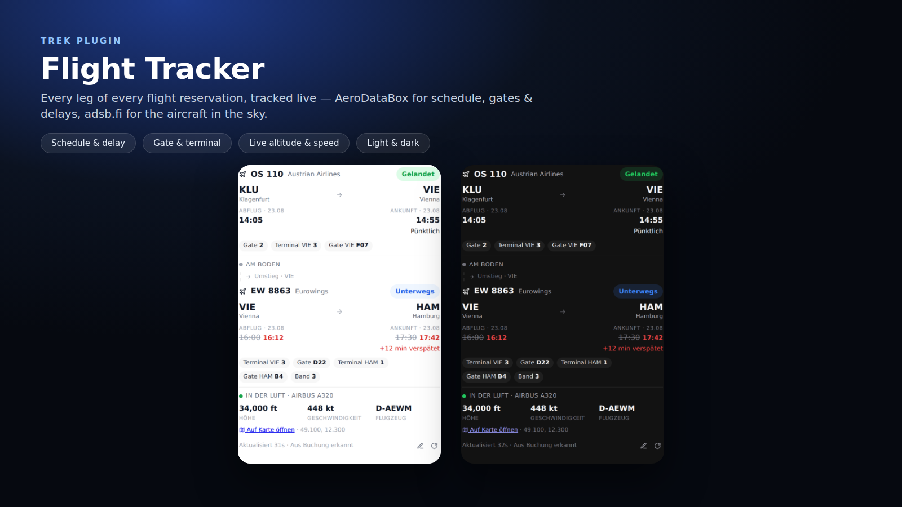

# Flight Tracker

Turn every flight reservation in TREK into a live flight tracker. The widget
sits under each reservation card in the trip planner and shows the real-time
status of that flight — combining scheduled data from **AeroDataBox** with the
actual aircraft position from the free **adsb.fi** open-data network.



## What it does

- **Reads the flight straight from the booking.** It builds the flight number
  from the reservation's airline + flight-number fields (e.g. `Austrian
  Airlines` + `254` → `OS254`), using a bundled database of ~1600 airlines. If it
  can't, you type it once and it is remembered for that reservation.
- **Multi-leg flights.** Connections are fully supported: a total-route header
  (e.g. `KLU → VIE → HAM`, gate-to-gate duration, overall status) sits above each
  leg (Austrian, then Eurowings), tracked separately with the **layover duration**
  and a **tight-connection warning** in between. Long itineraries collapse
  completed legs.
- **Native TREK look & locale-correct formatting.** The widget applies TREK's
  live theme tokens and formats times (12/24 h), dates, altitude/speed and
  coordinates via your locale; status shows an icon (not colour alone); an
  en-route leg draws a progress bar. Per-leg query dates come from the trip days,
  so overnight connections resolve correctly.
- **Schedule & status** (via AeroDataBox): departure/arrival airports, scheduled
  vs. estimated times, delay in minutes, live status (boarding, en route,
  arrived, cancelled), plus terminal, gate and baggage belt.
- **Live position in the air** (via adsb.fi): when the aircraft is transmitting
  ADS-B, it shows altitude, ground speed, climb/descent trend, registration and
  aircraft type, a **progress read-out** (percent complete, time remaining,
  distance to destination), and a **built-in minimap** that plots the route and
  the aircraft on an embedded vector world map — no external map tiles, so it
  works inside TREK's strict plugin sandbox. The great-circle route is drawn with
  the **flown part solid** and the **remaining part dashed**, and the aircraft is
  a marker **rotated to its heading**. Plus a one-tap link to a full live map.
- **Native TREK integration:** your flights also appear on the **trip map**
  (airport + live-aircraft markers), in the **trip PDF export**, and in the
  **TREK calendar** with live-adjusted times — no separate app needed.
- **Before departure:** a **boarding-time estimate**, an **inbound-aircraft**
  read-out ("your plane is on its way, ~40 min out"), and the arrival time also
  shown in **your own timezone**.
- **Future flights & no mix-ups.** Flight numbers repeat every day, so the
  lookup is pinned to the booking's **date**: AeroDataBox is queried for that
  exact day, and the live adsb.fi position is only fetched inside the flight's own
  time window and matched by the unique aircraft registration (with a key) or the
  ATC call sign — never a same-number flight on another day. Schedule, gate and
  delay are shown **on the ground** from ~48 h before departure; far-future
  flights show a countdown plus the booked route/times and light up
  automatically as departure approaches.
- **Works with or without an API key.** The AeroDataBox key is **instance-wide**
  and **admin-managed**: an admin sets it once through TREK's admin-guarded
  plugin-config API (`PUT /api/admin/plugins/flight-tracker/config`) and it
  applies to every user. It arrives in the plugin decrypted via `ctx.config`.
  (Setting it is genuinely admin-only — TREK's admin endpoints enforce that —
  whereas plugin routes cannot verify admin status themselves, so there is no
  in-widget key box.) Without a key you still get the free adsb.fi live position.
  Results are cached briefly so the public rate limits are respected.
- **Change alerts.** When a tracked flight is delayed, cancelled, changes gate or
  departs/arrives, delayed/cancelled flights appear as **native trip warnings**
  in the planner, and — while you have TREK open — you get a deduplicated
  bell/email notification. (TREK plugins can't send true background push, so
  alerts fire when the app is open or the trip is viewed.)
- **Re-detect button.** A one-tap "re-detect from booking" action re-reads the
  reservation (after you edit legs/flight numbers) and clears any manual override.
- **Stays out of the way** on non-flight reservations (trains, hotels, …).
- Native TREK look in both light and dark themes, German and English.

## Screenshots

See the image above (`docs/screenshot.png`), showing the widget with a delayed
Frankfurt → New York flight in both the light and dark theme: route, revised
times with the delay highlighted, gate/terminal/belt, and the live in-air block
with altitude and speed.

## Permissions

| Permission | Why |
|---|---|
| `db:own` | Stores the flight number linked to each reservation and a short-lived response cache in the plugin's own SQLite database. |
| `db:read:trips` | Reads the reservation to auto-detect its flight number. |
| `db:meta` | Best-effort mirror of the chosen flight number onto the reservation so other TREK surfaces can read it. |
| `notify:send` | Sends a bell/email notification to you (only) when a tracked flight's delay, gate or status changes while TREK is open. |
| `weather:read` | Shows the destination weather for the arrival day (host-cached forecast broker). |
| `hook:trip-warning-provider` | Shows delayed/cancelled flights as native trip warnings in the planner. |
| `hook:map-marker-provider` | Plots your flights' airports and live aircraft on TREK's own trip map. |
| `hook:pdf-section-provider` | Adds a flights section to the exported trip PDF. |
| `hook:calendar-source` | Puts your flights (with live-adjusted times) into TREK's calendar. |
| `http:outbound` | Marks the plugin as making outbound HTTP calls. |
| `http:outbound:aerodatabox.p.rapidapi.com` | Fetches flight schedule, status, gate and delay data from AeroDataBox. |
| `http:outbound:opendata.adsb.fi` | Fetches the live aircraft position from the adsb.fi open-data API. |

## Setup

1. Install and activate the plugin, then approve its permissions.
2. Open a trip, expand a flight reservation, and the tracker appears beneath it.
   The flight number(s) are detected from the booking; if not, type once to save.
   The **live adsb.fi position works with no key**.

### Adding the AeroDataBox key (admin) — unlocks schedule / gate / delay

The key is **instance-wide and admin-only**. Because of a current TREK core bug
([mauriceboe/TREK#1569](https://github.com/mauriceboe/TREK/issues/1569)) plugin
routes are never told whether the caller is an admin, so the key **cannot** be
entered in the widget yet — you would only get an *"admin only" / 403 / 404*
error. Until that TREK fix ships, set the key through TREK's own admin-guarded
config endpoint:

1. Get a free key at `rapidapi.com/aedbx-aedbx/api/aerodatabox`.
2. Log in as a **TREK administrator** (e.g. `admin@trek.local`), open the browser
   dev tools (**F12**) → **Console**, paste and run:
   ```js
   await fetch('/api/admin/plugins/flight-tracker/config', {
     method: 'PUT', credentials: 'include',
     headers: { 'Content-Type': 'application/json' },
     body: JSON.stringify({ aerodatabox_key: 'YOUR_RAPIDAPI_KEY' })
   }).then(r => r.json()).then(console.log);
   ```
   A masked response like `{ config: { aerodatabox_key: '••••••••' } }` means it
   was saved. To remove it, send `{ aerodatabox_key: '' }`.
3. **Reload the plugin** (Admin → Plugins → deactivate → activate) so it re-reads
   the config, then **hard-refresh** the trip tab (**Ctrl/Cmd+Shift+R**) so any
   old cached widget is replaced. The schedule, gate and delay data then appear
   for **all** users.

Once the TREK fix is released, an in-widget key field for admins will return.

Data sources: [AeroDataBox](https://aerodatabox.com/) and
[adsb.fi](https://adsb.fi/) — adsb.fi open data is for personal, non-commercial
use.

## License

MIT — see `LICENSE`.

---

[](https://ko-fi.com/fbnlrz) [](https://buymeacoffee.com/fbnlrz)
