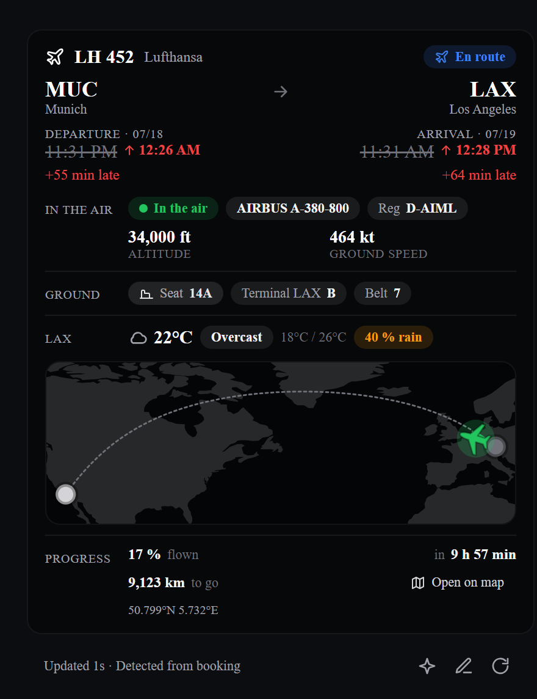
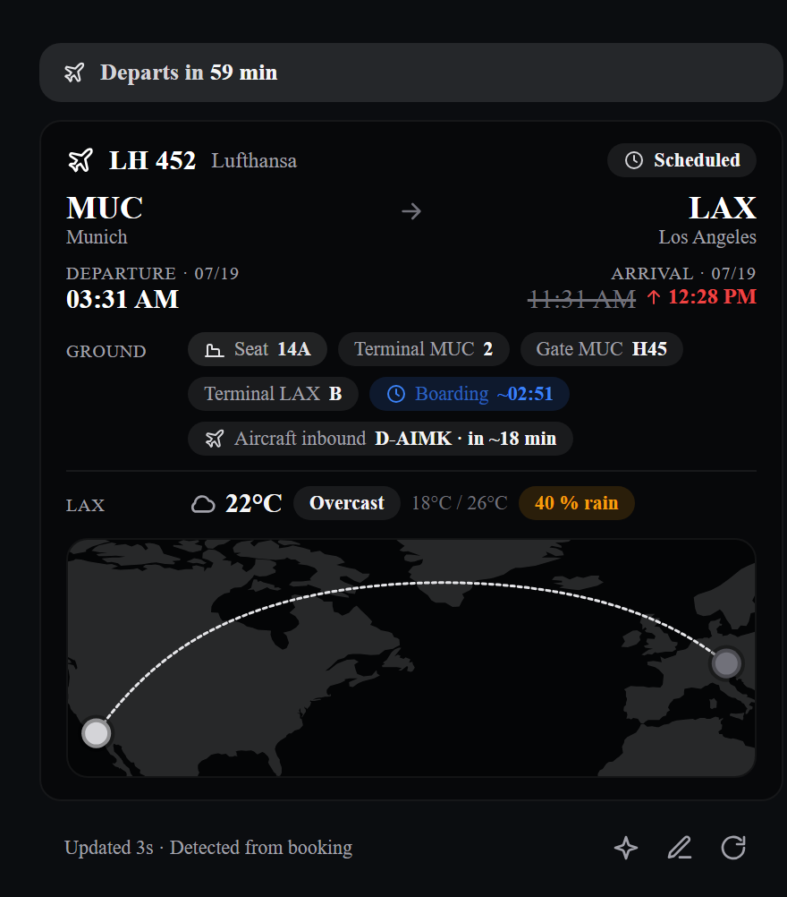
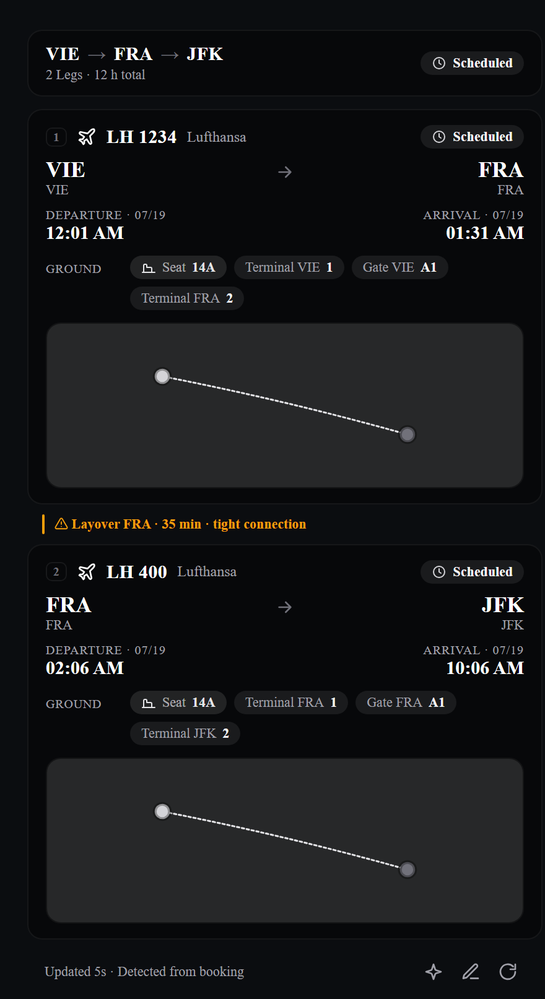
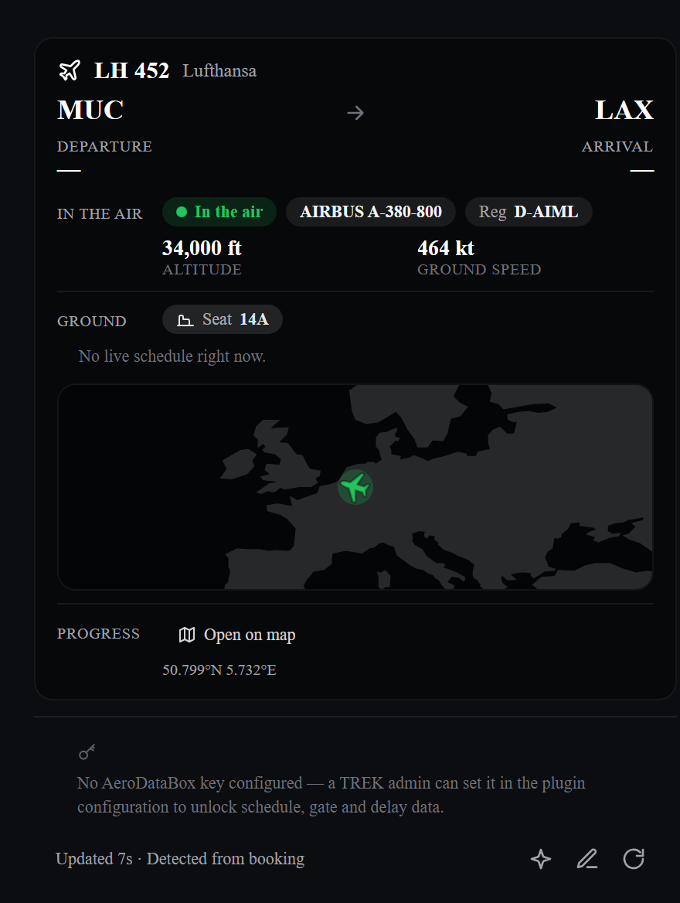
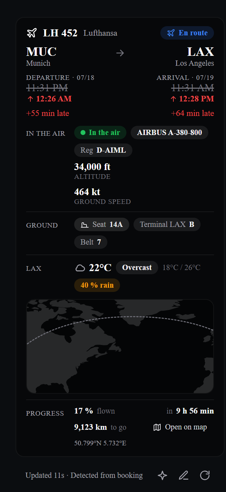

# Flight Tracker

Turn every flight reservation in TREK into a live flight tracker. The widget sits
under each reservation card in the trip planner and shows the real-time status of that
flight — combining scheduled data from **AeroDataBox** with the actual aircraft
position from the free **adsb.fi** open-data network.

Requires **TREK 3.4.0 or newer**.

📖 **[Full documentation in the wiki](https://github.com/fbnlrz/trek-track/wiki)** —
[Setup](https://github.com/fbnlrz/trek-track/wiki/Setup) ·
[Troubleshooting](https://github.com/fbnlrz/trek-track/wiki/Troubleshooting) ·
[How it works](https://github.com/fbnlrz/trek-track/wiki/How-it-works) ·
[Development](https://github.com/fbnlrz/trek-track/wiki/Development)



## Setup

1. **Admin → Plugins** — install and activate the plugin, then approve its permissions.
2. Open a trip and expand a flight reservation. The tracker appears beneath it. The
   flight number is detected from the booking; if not, type it once and it is
   remembered. The **live adsb.fi position works with no key**.
3. **Add the AeroDataBox key** to unlock schedule, terminal, gate, belt and delay. Get
   a free key at `rapidapi.com/aedbx-aedbx/api/aerodatabox`, then — **as a TREK
   administrator** — open any flight reservation and use **“Add AeroDataBox key”**
   under the tracker.

The key is **instance-wide**: one admin sets it once and everyone benefits. Once a key
is active the field disappears, since it is a set-once setting. Non-admins never see
it. There is also an admin config API for scripted setup, and it takes precedence over
the in-widget key.

> **Full setup, including how to change or remove a key, why TREK renders no settings
> form for it, and what to do when RapidAPI says “You are not subscribed to this
> API”** — see **[Setup](https://github.com/fbnlrz/trek-track/wiki/Setup)** and
> **[Troubleshooting](https://github.com/fbnlrz/trek-track/wiki/Troubleshooting)**.

## What it does

- **Reads the flight straight from the booking.** It builds the flight number from the
  reservation's airline + flight-number fields (e.g. `Austrian Airlines` + `254` →
  `OS254`), using a bundled database of ~2,800 airline name spellings.
- **Forgiving about how you type it.** `Frontier Airlines` + `1234`, `F9 1234`,
  `F91234` and the ICAO form `FFT1234` all resolve to the same flight, and airline
  names match loosely — `Delta Airlines`, `Delta Air Lines` and `Delta` are all
  understood. Airline codes containing a digit (`F9`, `U2`, `6E`, `W6`) are ~40 % of
  all codes and are parsed correctly. Codes are checked against a build-time probe
  list, so a stale upstream entry can't silently point a lookup at the wrong carrier.
- **Multi-leg flights.** Connections get a total-route header, per-leg tracking, the
  layover duration and a tight-connection warning. Long itineraries collapse completed
  legs.
- **Schedule & status** (AeroDataBox): departure/arrival airports, scheduled vs.
  revised times, **departure and arrival delay**, live status, plus terminal, gate and
  baggage belt.
- **Live position in the air** (adsb.fi): altitude, ground speed, climb/descent trend,
  registration and type, a progress read-out, and a **built-in minimap** drawing the
  great-circle route — flown part solid, remaining dashed, aircraft rotated to its
  heading. No external map tiles, so it works inside TREK's strict plugin sandbox. A
  position older than 5 minutes is marked stale rather than drawn as if live.
- **Before departure:** a boarding-time estimate, an **inbound-aircraft** read-out
  (“your plane is on its way, ~40 min out”), and the arrival time in your own timezone.
- **Native TREK integration:** flights also appear on the **trip map**, in the **trip
  PDF export** (date, route, terminal/gate, belt, seat, status), and in the **TREK
  calendar** with live-adjusted times.
- **Change alerts.** Delays, cancellations, diversions and gate changes surface as
  native trip warnings, and — while you have TREK open — a deduplicated bell/email
  notification in your own language.
- **Quota-aware.** The free AeroDataBox tier is ~600 requests/month, so the refresh
  interval follows time-to-departure and polling pauses when the tab is hidden.
- **Stays out of the way** on non-flight reservations, and works in light and dark
  theme, German and English.

## Screenshots

| Pre-flight | Multi-leg, tight connection |
|---|---|
|  |  |

| Without an API key | Narrow sidebar (320 px) |
|---|---|
|  |  |

Every shot also exists as a `-light` variant in [`docs/img/`](./docs/img). Regenerate
them with `npm run screenshots`.

## Permissions

| Permission | Why |
|---|---|
| `db:own` | Stores the flight number linked to each reservation and a short-lived response cache in the plugin's own SQLite database. |
| `db:read:trips` | Reads the reservation to auto-detect its flight number — and is the membership check that authorises every request. |
| `db:meta` | Best-effort mirror of the chosen flight number onto the reservation so other TREK surfaces can read it. |
| `notify:send` | Sends a bell/email notification to you (only) when a tracked flight's delay, gate or status changes while TREK is open. |
| `weather:read` | Shows the destination weather for the arrival day (host-cached forecast broker). |
| `hook:trip-warning-provider` | Shows delayed/cancelled flights as native trip warnings in the planner. |
| `hook:map-marker-provider` | Plots your flights' airports and live aircraft on TREK's own trip map. |
| `hook:pdf-section-provider` | Adds a flights section to the exported trip PDF. |
| `hook:calendar-source` | Puts your flights (with live-adjusted times) into TREK's calendar. |
| `http:outbound` | Marks the plugin as making outbound HTTP calls. |
| `http:outbound:aerodatabox.p.rapidapi.com` | Fetches flight schedule, status, gate and delay data from AeroDataBox. |
| `http:outbound:opendata.adsb.fi` | Fetches the live aircraft position from the adsb.fi open-data API. |

The booking reference (PNR) is deliberately not included in the widget payload.

Data sources: [AeroDataBox](https://aerodatabox.com/) and [adsb.fi](https://adsb.fi/) —
adsb.fi open data is for personal, non-commercial use.

The bundled airline database (`server/data/airlines.json`) is generated by
`npm run build:airlines` from
[Virtual Radar Server standing-data](https://github.com/vradarserver/standing-data)
(CC0, pinned to a commit) merged with
[OpenFlights](https://github.com/jpatokal/openflights) (ODbL), plus the hand-verified
fixes in `server/data/airline-overrides.json`.

## Development

```bash
npm install
npm run build:airlines   # regenerate the airline dataset (fails on a probe mismatch)
npm run screenshots      # regenerate docs/img/*
npx trek-plugin-sdk validate .
```

See **[Development](https://github.com/fbnlrz/trek-track/wiki/Development)** for the
release process, the override policy for airline codes, and the platform gotchas worth
knowing before changing anything.

## License

MIT — see `LICENSE`.

---

[](https://ko-fi.com/fbnlrz) [](https://buymeacoffee.com/fbnlrz)
