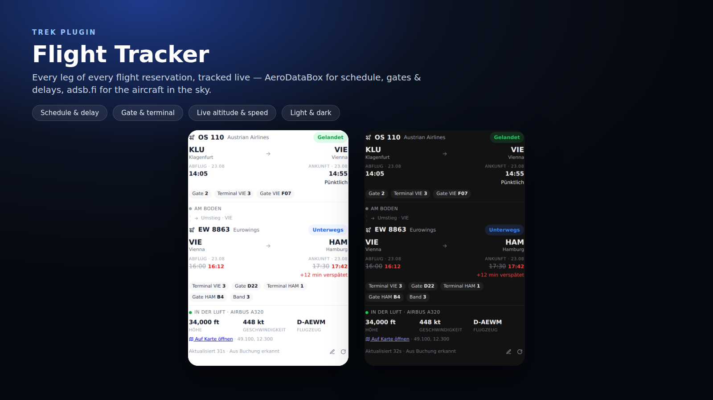

# Flight Tracker

Turn every flight reservation in TREK into a live flight tracker. The widget
sits under each reservation card in the trip planner and shows the real-time
status of that flight — combining scheduled data from **AeroDataBox** with the
actual aircraft position from the free **adsb.fi** open-data network.



## Setup

Requires **TREK 3.4.0 or newer**.

1. Install and activate the plugin, then approve its permissions.
2. Open a trip, expand a flight reservation, and the tracker appears beneath it.
   The flight number(s) are detected from the booking; if not, type once to save.
   The **live adsb.fi position works with no key**.

### Adding the AeroDataBox key (admin) — unlocks schedule / gate / delay

The key is **instance-wide**: one admin sets it once and every user on the
instance gets schedule, gate and delay data. Without it you still get the free
adsb.fi live position.

**In the widget (recommended).** Requires **TREK 3.4.0+**, which fixed plugin
admin detection ([TREK#1569](https://github.com/liketrek/TREK/issues/1569)) —
before 3.4 a plugin was never told the caller was an admin, which is why this
field was temporarily removed in v1.7.4.

1. Get a free key at `rapidapi.com/aedbx-aedbx/api/aerodatabox`.
2. Open any flight reservation **as a TREK administrator**. Under the tracker you
   will see **“Add AeroDataBox key”** — click it, paste the key, hit save.
3. That's it. The widget reloads with schedule data, and the key applies to
   everyone.

Once a key is active the field **disappears** — it is a set-once, instance-wide
setting, and repeating it on every flight reservation would only be noise. To
replace or remove it later, see *Changing or removing the key* below.

Non-admins never see the field — only a short note that an admin can add a key.

> **TREK has no settings form for this key.** TREK renders a settings form only
> for `scope: "user"` plugin settings; this key is `scope: "instance"`, which has
> no form anywhere in the UI (the list under Admin → Plugins is read-only and
> informational). The widget and the admin API are the two ways to set it.

**Alternative: the admin config API.** Useful for scripted or headless setup.
A key set this way **takes precedence** over one entered in the widget (see
*Where the key is read from* below).

1. Log in as a **TREK administrator**, open dev tools (**F12**) → **Console**:
   ```js
   await fetch('/api/admin/plugins/flight-tracker/config', {
     method: 'PUT', credentials: 'include',
     headers: { 'Content-Type': 'application/json' },
     body: JSON.stringify({ aerodatabox_key: 'YOUR_RAPIDAPI_KEY' })
   }).then(r => r.json()).then(console.log);
   ```
   A masked response like `{ config: { aerodatabox_key: '••••••••' } }` means it
   was saved. To remove it, send `{ aerodatabox_key: '' }`.
2. **Reload the plugin** (Admin → Plugins → deactivate → activate) so it re-reads
   the config, then **hard-refresh** the trip tab (**Ctrl/Cmd+Shift+R**).

**Where the key is read from.** `ctx.config.aerodatabox_key` (the admin config
API) is checked **first**; the key stored by the in-widget field is used only
when that is empty. So an explicitly admin-configured key can never be silently
shadowed by the widget. Setting or clearing the key drops the response cache, so
data updates immediately.

### Changing or removing the key

Which command you need depends on **how the key was set** — and they are not
interchangeable:

- **Set via the admin config API** → clear it with the same endpoint:
  `PUT /api/admin/plugins/flight-tracker/config` with `{ aerodatabox_key: '' }`.
- **Set in the widget** → clear it through the plugin's own route. Note that the
  config-API call above will **not** remove a widget-set key: it only empties
  `ctx.config`, after which the plugin falls back to the stored key and it
  reappears. As a **TREK administrator**, in dev tools (**F12**) → **Console**:
  ```js
  await fetch('/api/plugins/flight-tracker/key', {
    method: 'POST', credentials: 'include',
    headers: { 'Content-Type': 'application/json' },
    body: JSON.stringify({ apiKey: '' })          // or a new key to replace it
  }).then(r => r.json()).then(console.log);
  ```
  `{ ok: true, hasKey: false }` means it was cleared. The “Add AeroDataBox key”
  field then reappears in the widget for admins. This route is admin-only and
  answers `403` for anyone else.

## What it does

- **Reads the flight straight from the booking.** It builds the flight number
  from the reservation's airline + flight-number fields (e.g. `Austrian
  Airlines` + `254` → `OS254`), using a bundled database of ~2,800 airline name
  spellings. If it can't, you type it once and it is remembered for that
  reservation.
- **Forgiving about how you type it.** `Frontier Airlines` + `1234`,
  `F9 1234`, `F91234` and even the ICAO form `FFT1234` all resolve to the same
  flight, and airline names match loosely — `Delta Airlines`, `Delta Air Lines`
  and `Delta` are all understood. Airline codes containing a digit (`F9`
  Frontier, `U2` easyJet, `6E` IndiGo, `W6` Wizz Air) are parsed correctly; they
  are 40 % of all airline codes and used to break the lookup. Codes are checked
  against a build-time probe list, so a stale upstream entry can't silently point
  a lookup at the wrong carrier.
- **Multi-leg flights.** Connections are fully supported: a total-route header
  (e.g. `KLU → VIE → HAM`, gate-to-gate duration, overall status) sits above each
  leg (Austrian, then Eurowings), tracked separately with the **layover duration**
  and a **tight-connection warning** in between. Long itineraries collapse
  completed legs.
- **Native TREK look & locale-correct formatting.** The widget applies TREK's
  live theme tokens and formats times (12/24 h), dates, altitude/speed and
  coordinates via your locale; status shows an icon (not colour alone); an
  en-route leg draws a progress bar. Per-leg query dates come from the trip days,
  so overnight connections resolve correctly.
- **Schedule & status** (via AeroDataBox): departure/arrival airports, scheduled
  vs. estimated times, delay in minutes, live status (boarding, en route,
  arrived, cancelled), plus terminal, gate and baggage belt.
- **Live position in the air** (via adsb.fi): when the aircraft is transmitting
  ADS-B, it shows altitude, ground speed, climb/descent trend, registration and
  aircraft type, a **progress read-out** (percent complete, time remaining,
  distance to destination), and a **built-in minimap** that plots the route and
  the aircraft on an embedded vector world map — no external map tiles, so it
  works inside TREK's strict plugin sandbox. The great-circle route is drawn with
  the **flown part solid** and the **remaining part dashed**, and the aircraft is
  a marker **rotated to its heading**. Plus a one-tap link to a full live map.
- **Native TREK integration:** your flights also appear on the **trip map**
  (airport + live-aircraft markers), in the **trip PDF export**, and in the
  **TREK calendar** with live-adjusted times — no separate app needed.
- **Before departure:** a **boarding-time estimate**, an **inbound-aircraft**
  read-out ("your plane is on its way, ~40 min out"), and the arrival time also
  shown in **your own timezone**.
- **Future flights & no mix-ups.** Flight numbers repeat every day, so the
  lookup is pinned to the booking's **date**: AeroDataBox is queried for that
  exact day, and the live adsb.fi position is only fetched inside the flight's own
  time window and matched by the unique aircraft registration (with a key) or the
  ATC call sign — never a same-number flight on another day. Schedule, gate and
  delay are shown **on the ground** from ~48 h before departure; far-future
  flights show a countdown plus the booked route/times and light up
  automatically as departure approaches.
- **Works with or without an API key.** The AeroDataBox key is **instance-wide**
  and **admin-only**: an admin sets it once — in the widget itself, or through
  TREK's admin-guarded plugin-config API
  (`PUT /api/admin/plugins/flight-tracker/config`) — and it applies to every
  user. The in-widget field is gated on the **server** re-checking
  `req.user.isAdmin` on every request, so a non-admin is refused with `403` even
  if the UI is tampered with. Without a key you still get the free adsb.fi live
  position. Results are cached briefly so the public rate limits are respected.
- **Change alerts.** When a tracked flight is delayed, cancelled, changes gate or
  departs/arrives, delayed/cancelled flights appear as **native trip warnings**
  in the planner, and — while you have TREK open — you get a deduplicated
  bell/email notification. (TREK plugins can't send true background push, so
  alerts fire when the app is open or the trip is viewed.)
- **Re-detect button.** A one-tap "re-detect from booking" action re-reads the
  reservation (after you edit legs/flight numbers) and clears any manual override.
- **Stays out of the way** on non-flight reservations (trains, hotels, …).
- Native TREK look in both light and dark themes, German and English.

## Screenshots

See the image above (`docs/screenshot.png`), showing the widget with a delayed
Frankfurt → New York flight in both the light and dark theme: route, revised
times with the delay highlighted, gate/terminal/belt, and the live in-air block
with altitude and speed.

## Permissions

| Permission | Why |
|---|---|
| `db:own` | Stores the flight number linked to each reservation and a short-lived response cache in the plugin's own SQLite database. |
| `db:read:trips` | Reads the reservation to auto-detect its flight number. |
| `db:meta` | Best-effort mirror of the chosen flight number onto the reservation so other TREK surfaces can read it. |
| `notify:send` | Sends a bell/email notification to you (only) when a tracked flight's delay, gate or status changes while TREK is open. |
| `weather:read` | Shows the destination weather for the arrival day (host-cached forecast broker). |
| `hook:trip-warning-provider` | Shows delayed/cancelled flights as native trip warnings in the planner. |
| `hook:map-marker-provider` | Plots your flights' airports and live aircraft on TREK's own trip map. |
| `hook:pdf-section-provider` | Adds a flights section to the exported trip PDF. |
| `hook:calendar-source` | Puts your flights (with live-adjusted times) into TREK's calendar. |
| `http:outbound` | Marks the plugin as making outbound HTTP calls. |
| `http:outbound:aerodatabox.p.rapidapi.com` | Fetches flight schedule, status, gate and delay data from AeroDataBox. |
| `http:outbound:opendata.adsb.fi` | Fetches the live aircraft position from the adsb.fi open-data API. |

Data sources: [AeroDataBox](https://aerodatabox.com/) and
[adsb.fi](https://adsb.fi/) — adsb.fi open data is for personal, non-commercial
use.

The bundled airline database (`server/data/airlines.json`) is generated by
`npm run build:airlines` from
[Virtual Radar Server standing-data](https://github.com/vradarserver/standing-data)
(CC0, pinned to a commit) merged with
[OpenFlights](https://github.com/jpatokal/openflights) (ODbL), plus the
hand-verified fixes in `server/data/airline-overrides.json`. The build asserts a
probe list of known airline codes and fails rather than shipping a wrong one.

## Development

```bash
npm install
npm test           # unit + authorization tests (no network, no TREK host needed)
npm run test:render   # renders the widget in headless Chrome with TREK's real kit
npm run build:airlines # regenerate server/data/airlines.json from upstream sources
```

`npm test` covers the flight-number parser, airline resolution, the time/window
arithmetic, the notification logic and — most importantly — the route
authorization gate. Those authorization tests are deliberately verifiable as
non-vacuous: point the suite at an older build with
`FT_SERVER=/path/to/old/server/index.js npm test` and they fail.

`npm run test:render` needs a Chrome or Edge binary (or `CHROME_PATH`); it skips
rather than fails when none is present.

### Notes for contributors

- **Where the widget-set key lives.** A key entered in the widget is stored in
  the plugin's own SQLite file. TREK encrypts `secret: true` settings at rest,
  but that applies to the admin config API path (`ctx.config`) — the widget path
  does not get that protection. Prefer the config API where it matters.
- **Calendar events need AeroDataBox.** Events are built only from authoritative
  UTC times returned by a status lookup, so a keyless instance produces none, and
  a flight further out than the status window produces none until it comes into
  range. This is deliberate: an event built from the reservation's naive local
  time could be hours off, and a wrong calendar entry is worse than none.

## License

MIT — see `LICENSE`.

---

[](https://ko-fi.com/fbnlrz) [](https://buymeacoffee.com/fbnlrz)
